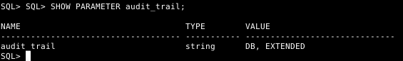
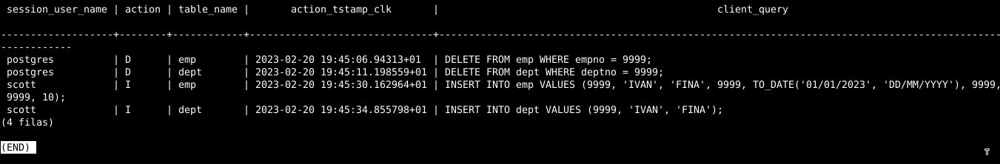
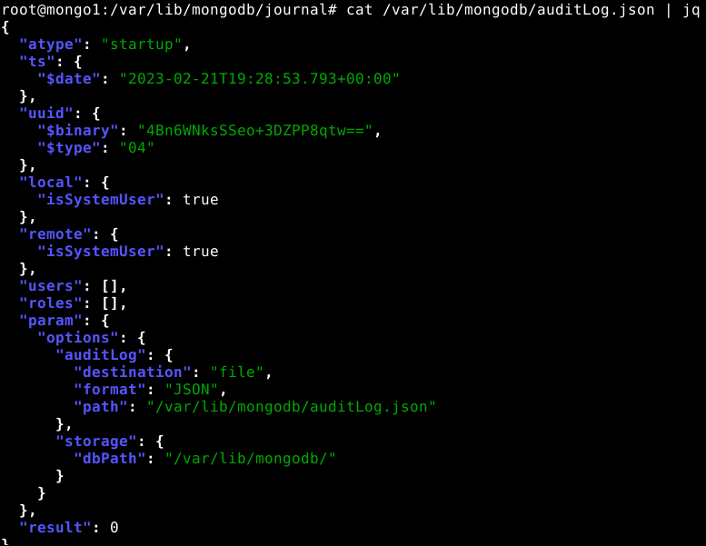

# **ABD**
## **Auditoría**
#### Realizado por: **Iván Piña Castillo**

------------------------------------------------------------------------------------------------------------------------------------------------

## 1. Activa desde SQL*Plus la auditoría de los intentos de acceso exitosos al sistema. Comprueba su funcionamiento.

Deberemos comprobar en primer lugar que las auditorías están activas:

```sql
SELECT name, value 
FROM v$parameter 
WHERE name LIKE 'audit_trail';
```


En mi caso, la auditoría está activada, en caso de que no lo estuviera para activarla ejecutaríamos:
```sql
ALTER SYSTEM SET audit_trail = db scope=spfile;
```


Hecho esto, tendríamos que tener que reiniciar el servicio de Oracle para que los cambios surtan efecto:
```sql
shutdown immediate;
startup;
```

Entonces comprobaríamos que la auditoría está activada con el comando del principio:
```sql
SELECT name, value 
FROM v$parameter 
WHERE name LIKE 'audit_trail';
```

Para desactivar la auditoría, ejecutaríamos:
```sql
ALTER SYSTEM SET audit_trail = none scope=spfile;
```

Ahora, vamos a activar la auditoría de los intentos de acceso exitosos al sistema:
```sql
AUDIT CREATE SESSION BY ACCESS;
```


Y por último, vamos a comprobar que funciona con un usuario y contraseña correctos:
```sql
connect SCOTT/TIGER;
```


Me he logueado varias con el usuario SCOTT y el usuario SYS.

Ahora, vamos a comprobar que se han guardado los accesos en la tabla de auditoría:
```sql
SELECT OS_USERNAME, USERNAME, EXTENDED_TIMESTAMP, ACTION_NAME 
FROM DBA_AUDIT_SESSION;
```


------------------------------------------------------------------------------------------------------------------------------------------------

## 2. Realiza un procedimiento en PL/SQL que te muestre los accesos fallidos junto con el motivo de los mismos, transformando el código de error almacenado en un mensaje de texto comprensible. Contempla todos los motivos posibles para que un acceso sea fallido.

Primero debemos activar la auditoría de intentos de acceso fallidos, ejecutamos lo siguiente:
```sql
AUDIT CREATE SESSION WHENEVER NOT SUCCESSFUL;
```


Para comprobar que la auditoría funciona, vamos a intentar acceder a la base de datos con un usuario que no existe:
```sql
connect noexiste/noexiste;
```


Vamos a comprobarlo también con un usuario que sí existe pero con una contraseña incorrecta:
```sql
connect SCOTT/LION;
```


Para realizar el procedimiento, voy a crear también una función que se encargará de registar los accesos fallidos en la tabla de auditoría:

Así que, primero creamos la función:
```sql
CREATE OR REPLACE FUNCTION f_AccesosFallidos (p_error NUMBER) 
RETURN VARCHAR2
IS
    v_mensaje VARCHAR2(100);
BEGIN
    CASE p_error
        WHEN 911 THEN v_mensaje := 'Contiene un carácter inválido.';
        WHEN 1004 THEN v_mensaje := 'El acceso se ha denegado.';
        WHEN 1017 THEN v_mensaje := 'Usuario o Contraseña incorrecta.';
        WHEN 1033 THEN v_mensaje := 'Usuario no existe.';
        WHEN 1045 THEN v_mensaje:='El usuario no tiene el permiso CREATE SESSION.';
        WHEN 28000 THEN v_mensaje := 'Usuario bloqueado.';
        WHEN 28001 THEN v_mensaje := 'Contraseña caducada.';
        WHEN 28002 THEN v_mensaje := 'La contraseña va a caducar pronto.';
        WHEN 28003 THEN v_mensaje := 'La contraseña no cumple la verificación de complejidad.';
        WHEN 28007 THEN v_mensaje := 'Se ha tratado de reutilizar una contraseña.';
        WHEN 28008 THEN v_mensaje := 'Contraseña antigua inválida.';
        WHEN 28009 THEN v_mensaje := 'La conexión a SYS debe ser a través de SYSDBA o SYSOPER.';
        WHEN 28011 THEN v_mensaje:='La cuenta va a caducar pronto, deberías cambiar la contraseña.';
        WHEN 28511 THEN v_mensaje := 'Contraseña expirada';
        WHEN 28512 THEN v_mensaje := 'Cuenta bloqueada';
        ELSE v_mensaje:='Error no registrado, contacte con el administrador para más información.';
    END CASE;
RETURN v_mensaje;
END f_AccesosFallidos;
/
```

Ahora, creamos el procedimiento que llamará a la función anterior y que nos mostrará los accesos fallidos:
```sql
CREATE OR REPLACE PROCEDURE p_MostrarAccesosFallidos
IS
    CURSOR c_accesos IS
        SELECT os_username, username, returncode, timestamp
        FROM dba_audit_session
        WHERE action_name='LOGON'
        AND returncode != 0
        ORDER BY timestamp;
    v_mensaje VARCHAR2(100);
BEGIN
    dbms_output.put_line('Accesos fallidos:');
    FOR accesos IN c_accesos LOOP
        v_mensaje := f_AccesosFallidos(accesos.returncode);
        dbms_output.put_line('------------------------------------------------------------------------------------------------');
        dbms_output.put_line('Usuario del Sistema: ' || accesos.os_username || ' - ' || 'Usuario: ' || accesos.username || ' - ' || 'Fecha: ' || TO_CHAR(accesos.timestamp,'YY/MM/DD DY HH24:MI') || ' - ' || 'Motivo: ' || v_mensaje);
    END LOOP;
END p_MostrarAccesosFallidos;
/
```

Ahora, vamos a probar el procedimiento:
```sql
set serveroutput on;
exec p_MostrarAccesosFallidos;
```


------------------------------------------------------------------------------------------------------------------------------------------------

## 3. Activa la auditoría de las operaciones DML realizadas por SCOTT. Comprueba su funcionamiento.

Para activar la auditoría de las operaciones DML realizadas por SCOTT, deberemos ejecutar el siguiente comando:
```sql
AUDIT INSERT TABLE, UPDATE TABLE, DELETE TABLE BY SCOTT BY ACCESS;
```


Ahora, nos tendremos que conectar con el usuario SCOTT y crearemos una tabla a la que le insertaremos registros para comprobar que la auditoría funciona:
```sql
connect SCOTT/TIGER;

CREATE TABLE AUDIT_TEST2 (
    ID NUMBER(10) NOT NULL,
    NOMBRE VARCHAR2(50) NOT NULL,
    PRIMARY KEY (ID)
);

INSERT INTO AUDIT_TEST2 VALUES (1, 'PRUEBA');
INSERT INTO AUDIT_TEST2 VALUES (2, 'PRUEBA2');
INSERT INTO AUDIT_TEST2 VALUES (3, 'PRUEBA3');
INSERT INTO AUDIT_TEST2 VALUES (4, 'PRUEBA4');
INSERT INTO AUDIT_TEST2 VALUES (5, 'PRUEBA5');
INSERT INTO AUDIT_TEST2 VALUES (6, 'PRUEBA6');
INSERT INTO AUDIT_TEST2 VALUES (7, 'PRUEBA7');

UPDATE AUDIT_TEST2 SET NOMBRE = 'PRUEBA8' WHERE ID = 1;
UPDATE AUDIT_TEST2 SET NOMBRE = 'PRUEBA9' WHERE ID = 2;
UPDATE AUDIT_TEST2 SET NOMBRE = 'PRUEBA10' WHERE ID = 3;

DELETE FROM AUDIT_TEST2 WHERE ID = 4;
DELETE FROM AUDIT_TEST2 WHERE ID = 5;
DELETE FROM AUDIT_TEST2 WHERE ID = 6;
```

Ahora, nos conectaremos con el usuario SYS y comprobaremos que se ha registrado la auditoría:
```sql
SELECT obj_name, action_name, timestamp 
FROM dba_audit_object 
WHERE username='SCOTT';
```

-


Como podemos ver la auditoría ha registrado todas las operaciones DML realizadas por SCOTT.

------------------------------------------------------------------------------------------------------------------------------------------------

## 4. Realiza una auditoría de grano fino para almacenar información sobre la inserción de empleados con sueldo superior a 2000 en la tabla emp de scott.

Para realizar la auditoría de grano fino, deberemos ejecutar el siguiente comando:
```sql
BEGIN
    DBMS_FGA.ADD_POLICY (
    OBJECT_SCHEMA => 'SCOTT',
    OBJECT_NAME => 'EMP',
    POLICY_NAME => 'AUDIT_FINA_IVAN',
    AUDIT_CONDITION => 'SAL > 2000',
    STATEMENT_TYPES => 'INSERT'
    );
END;
/
```


Ahora, nos conectaremos con el usuario SCOTT y crearemos una tabla a la que le insertaremos registros para comprobar que la auditoría funciona:
```sql
connect SCOTT/TIGER;

INSERT INTO EMP VALUES (9999, 'PRUEBA', 'ANALISTA', 9999, TO_DATE('01/01/2019','DD/MM/YYYY'), 4000, 999, 10);
INSERT INTO EMP VALUES (9998, 'PRUEBA2', 'ANALISTA', 9998, TO_DATE('01/01/2019','DD/MM/YYYY'), 1500, 998, 10);
```


El primer registro sí debería de aparecer en la auditoría, pero el segundo no, ya que su salario es inferior a 2000.

Ahora, nos conectaremos con el usuario SYS y comprobaremos que se ha registrado la auditoría:
```sql
SELECT DB_USER, OBJECT_NAME, SQL_TEXT, EXTENDED_TIMESTAMP 
FROM DBA_FGA_AUDIT_TRAIL 
WHERE POLICY_NAME='AUDIT_FINA_IVAN';
```


Como podemos ver, sólo se ha registrado la inserción del primer registro, ya que su salario es superior a 2000.

------------------------------------------------------------------------------------------------------------------------------------------------

## 5. Explica la diferencia entre auditar una operación by access o by session ilustrándolo con ejemplos.

La auditoría by access se refiere a la auditoría que registra una entrada de auditoría cada vez que se realiza una operación DML.
Por ejemplo, la auditoría by access puede registrar si un usuario inserta, actualiza o elimina una fila de una tabla. 
Un ejemplo de su sintaxis sería:
```sql
AUDIT INSERT TABLE, UPDATE TABLE, DELETE TABLE BY SCOTT BY ACCESS;
```

He decicido usar el ejemplo anterior para ilustrar la diferencia entre ambas auditorías:
```sql
SELECT USERNAME,ACTION_NAME,TIMESTAMP, obj_name from DBA_AUDIT_OBJECT where USERNAME='SCOTT';
```


La auditoría by session, por otro lado, se refiere a la auditoría que solo registra una entrada de auditoría por sesión. 
Esto nos indica que by session crea un registro menos detallado que by access, pero que beneficia el rendimiento de la base de datos.
Un ejemplo de su sintaxis sería:
```sql
AUDIT INSERT TABLE, UPDATE TABLE, DELETE TABLE BY SCOTT BY SESSION;
```

He decicido usar el ejemplo anterior para ilustrar la diferencia entre ambas auditorías:

Pero antes, nos tendremos que conectar con el usuario SCOTT y crearemos una tabla a la que le insertaremos registros para comprobar que la auditoría funciona:
```sql
connect SCOTT/TIGER;

CREATE TABLE AUDIT_TEST2 (
    ID NUMBER(10) NOT NULL,
    NOMBRE VARCHAR2(50) NOT NULL,
    PRIMARY KEY (ID)
);

INSERT INTO AUDIT_TEST2 VALUES (1, 'PRUEBA');
INSERT INTO AUDIT_TEST2 VALUES (2, 'PRUEBA2');
INSERT INTO AUDIT_TEST2 VALUES (3, 'PRUEBA3');
INSERT INTO AUDIT_TEST2 VALUES (4, 'PRUEBA4');
INSERT INTO AUDIT_TEST2 VALUES (5, 'PRUEBA5');
INSERT INTO AUDIT_TEST2 VALUES (6, 'PRUEBA6');
INSERT INTO AUDIT_TEST2 VALUES (7, 'PRUEBA7');

UPDATE AUDIT_TEST2 SET NOMBRE = 'PRUEBA8' WHERE ID = 1;
UPDATE AUDIT_TEST2 SET NOMBRE = 'PRUEBA9' WHERE ID = 2;
UPDATE AUDIT_TEST2 SET NOMBRE = 'PRUEBA10' WHERE ID = 3;

DELETE FROM AUDIT_TEST2 WHERE ID = 4;
DELETE FROM AUDIT_TEST2 WHERE ID = 5;
DELETE FROM AUDIT_TEST2 WHERE ID = 6;
```

```sql
SELECT USERNAME,ACTION_NAME,TIMESTAMP, obj_name from DBA_AUDIT_OBJECT where USERNAME='SCOTT';
```


------------------------------------------------------------------------------------------------------------------------------------------------

## 6. Documenta las diferencias entre los valores db y db, extended del parámetro audit_trail de ORACLE. Demuéstralas poniendo un ejemplo de la información sobre una operación concreta recopilada con cada uno de ellos.

Los dos niveles de auditoría se activan en el sistema. La diferencia entre ellos es que "db, extended" guarda también los datos de "SQLBIND" y "SQLTEXT" en la tabla "SYS.AUD$", mientras que "db" no los almacena.

Veamos un ejemplo:

- Vamos a ver que valor tiene el parámetro "audit_trail" por defecto:
```sql
SHOW PARAMETER audit_trail;
```


Como podemos ver, el valor por defecto es "db".

- Acto seguido, vamos a comprobar que información recolecta la auditoría "db":
```sql
SELECT USERNAME,ACTION_NAME,TIMESTAMP, obj_name from DBA_AUDIT_OBJECT where USERNAME='SCOTT';
```


La información que nos muestra es la que hemos estado viendo hasta ahora.

- Tras esto, activaremos la auditoría "db, extended":
```sql
ALTER SYSTEM SET audit_trail = DB,EXTENDED SCOPE=SPFILE;
```


- Hecho esto, deberemos reiniciar la base de datos para que los cambios surtan efecto:
```sql
shutdown immediate;
startup;
```


- Comprobaremos que la auditoría está activada:
```sql
SHOW PARAMETER audit_trail;
```


- Para poder comprobar que la auditoría "db, extended" funciona, vamos a crear una tabla y trabajaremos con ella:
```sql
connect SCOTT/TIGER;

CREATE TABLE AUDIT_TEST3 (
    ID NUMBER(10) NOT NULL,
    NOMBRE VARCHAR2(50) NOT NULL,
    PRIMARY KEY (ID)
);

INSERT INTO AUDIT_TEST3 VALUES (1, 'PRUEBA');
INSERT INTO AUDIT_TEST3 VALUES (2, 'PRUEBA2');
INSERT INTO AUDIT_TEST3 VALUES (3, 'PRUEBA3');
INSERT INTO AUDIT_TEST3 VALUES (4, 'PRUEBA4');
INSERT INTO AUDIT_TEST3 VALUES (5, 'PRUEBA5');
INSERT INTO AUDIT_TEST3 VALUES (6, 'PRUEBA6');

UPDATE AUDIT_TEST3 SET NOMBRE = 'PRUEBA8' WHERE ID = 1;
UPDATE AUDIT_TEST3 SET NOMBRE = 'PRUEBA9' WHERE ID = 2;
UPDATE AUDIT_TEST3 SET NOMBRE = 'PRUEBA10' WHERE ID = 3;

DELETE FROM AUDIT_TEST3 WHERE ID = 4;
DELETE FROM AUDIT_TEST3 WHERE ID = 5;
DELETE FROM AUDIT_TEST3 WHERE ID = 6;
```

- Ahora, vamos a comprobar que información recolecta la auditoría "db, extended":
```sql
SELECT USERNAME,ACTION_NAME,TIMESTAMP, obj_name, sql_text, sql_bind from DBA_AUDIT_OBJECT where USERNAME='SCOTT';
```

Podemos ver que en los registros de las auditorías anteriores no aparece la nueva información:


Pero en los registros de la auditoría "db, extended" sí que aparece:


------------------------------------------------------------------------------------------------------------------------------------------------

## 7. Averigua si en Postgres se pueden realizar los cuatro primeros apartados. Si es así, documenta el proceso adecuadamente.

La comprobación de los accesos fallidos a la base de datos no es como en Oracle. Si queremos ver dichos intentos, tenemos que mirar en los logs de PostgreSQL. 

Primero iniciaremos sesión en la base de datos como usuario scott e introduciremos una contraseña incorrecta:
```bash
psql -h localhost -U scott -d scott
```

Dichos logs se encuentran en la ruta /var/log/postgresql, y no contienen tanta información como en oracle:
```bash
cat /var/log/postgresql/postgresql-13-main.log
```


En caso de introducir un usuario que no exista, el log nos mostrará el siguiente mensaje:


PostgreSQL no incorpora una herramienta para realizar auditorías, por lo que tenemos que hacer uso de una herramienta que ha creado la comunidad para realizar dichas auditorías: Audit trigger 91plus. Esta herramienta nos permite realizar auditorías de las operaciones DML (INSERT, UPDATE, DELETE) y DDL (CREATE, ALTER, DROP) de las tablas de la base de datos. Para instalarla, debemos seguir los siguientes pasos:

- Descargamos la herramienta audit trigger 91plus:
```bash
wget https://raw.githubusercontent.com/2ndQuadrant/audit-trigger/master/audit.sql
```


- Una vez descargada, la importamos en la base de datos:
```bash
\i audit.sql
```


- Tras haber activado las auditorías con esta herramienta, en caso de que queramos ver las operaciones DML que realice un usuario, (por ejemplo SCOTT) deberemos indicarlo tabla por tabla, puesto que no se puede realizar una auditoría global de todas las tablas de la base de datos. Para ello, deberemos ejecutar el siguiente comando:
```sql
SELECT audit.audit_table('scott.emp');
SELECT audit.audit_table('scott.dept');
```


- Para pobrar que la auditoría funciona, vamos a insertar un registro en la tabla "emp":
```sql
INSERT INTO emp VALUES (9999, 'IVAN', 'FINA', 9999, TO_DATE('01/01/2023', 'DD/MM/YYYY'), 9999, 9999, 10);
INSERT INTO dept VALUES (9999, 'IVAN', 'FINA');

DELETE FROM emp WHERE empno = 9999;
DELETE FROM dept WHERE deptno = 9999;
```


- Ahora, vamos a comprobar que la auditoría ha funcionado correctamente:
```sql
select session_user_name, action, table_name, action_tstamp_clk, client_query 
from audit.logged_actions;
```


Como podemos apreciar, la auditoría funciona correctamente. Nos está mostrando: el usuario que ha realizado la operación, la operación que ha realizado, la tabla en la que ha realizado la operación, la fecha y hora en la que ha realizado la operación y la consulta que ha realizado el usuario. También nos muestra como anteriormente, el usuario postgres eliminó dos resgistros antes de que el usuario scott insertara los suyos.

En caso de que no queramos usar una aplicación externa para realizar auditorías, podemos crear Triggers para realizar auditorías de las operaciones DML y DDL de las tablas de la base de datos. Para ello, deberemos crear un trigger para cada tabla de la base de datos. Seguiremos los siguientes pasos que he encontrado por internet:
```sql
-- Crea un esquema llamado "audit"
create schema audit;
revoke create on schema audit from public;

create table audit.logged_actions (
    schema_name text not null,
    table_name text not null,
    user_name text,
    action_tstamp timestamp with time zone not null default current_timestamp,
    action TEXT NOT NULL check (action in ('I','D','U')),
    original_data text,
    new_data text,
    query text
) with (fillfactor=100);

revoke all on audit.logged_actions from public;

-- Podemos usar diferentes permisos; 
-- esto permitiría ver a cualquiera los 
-- datos de auditoría completos.

grant select on audit.logged_actions to public;

create index logged_actions_schema_table_idx 
on audit.logged_actions(((schema_name||'.'||table_name)::TEXT));

create index logged_actions_action_tstamp_idx 
on audit.logged_actions(action_tstamp);

create index logged_actions_action_idx 
on audit.logged_actions(action);

-- Ahora, tendríamos que definir lña función que se ejecutará cuando se active el trigger:

CREATE OR REPLACE FUNCTION audit.if_modified_func() RETURNS trigger AS $body$
DECLARE
    v_old_data TEXT;
    v_new_data TEXT;
BEGIN
    /*  Si esto realmente fuese para auditoría real (donde necesitas registrar TODA la información),
        entonces necesitarías usar algo como dblink o plperl que pueda registrar fuera de la transacción,
        independientemente de si la transacción se confirmó o se deshizo.
    */

    if (TG_OP = 'UPDATE') then
        v_old_data := ROW(OLD.*);
        v_new_data := ROW(NEW.*);
        insert into audit.logged_actions (schema_name,table_name,user_name,action,original_data,new_data,query) 
        values (TG_TABLE_SCHEMA::TEXT,TG_TABLE_NAME::TEXT,session_user::TEXT,substring(TG_OP,1,1),v_old_data,v_new_data, current_query());
        RETURN NEW;
    elsif (TG_OP = 'DELETE') then
        v_old_data := ROW(OLD.*);
        insert into audit.logged_actions (schema_name,table_name,user_name,action,original_data,query)
        values (TG_TABLE_SCHEMA::TEXT,TG_TABLE_NAME::TEXT,session_user::TEXT,substring(TG_OP,1,1),v_old_data, current_query());
        RETURN OLD;
    elsif (TG_OP = 'INSERT') then
        v_new_data := ROW(NEW.*);
        insert into audit.logged_actions (schema_name,table_name,user_name,action,new_data,query)
        values (TG_TABLE_SCHEMA::TEXT,TG_TABLE_NAME::TEXT,session_user::TEXT,substring(TG_OP,1,1),v_new_data, current_query());
        RETURN NEW;
    else
        RAISE WARNING '[AUDIT.IF_MODIFIED_FUNC] - Other action occurred: %, at %',TG_OP,now();
        RETURN NULL;
    end if;

EXCEPTION
    WHEN data_exception THEN
        RAISE WARNING '[AUDIT.IF_MODIFIED_FUNC] - UDF ERROR [DATA EXCEPTION] - SQLSTATE: %, SQLERRM: %',SQLSTATE,SQLERRM;
        RETURN NULL;
    WHEN unique_violation THEN
        RAISE WARNING '[AUDIT.IF_MODIFIED_FUNC] - UDF ERROR [UNIQUE] - SQLSTATE: %, SQLERRM: %',SQLSTATE,SQLERRM;
        RETURN NULL;
    WHEN others THEN
        RAISE WARNING '[AUDIT.IF_MODIFIED_FUNC] - UDF ERROR [OTHER] - SQLSTATE: %, SQLERRM: %',SQLSTATE,SQLERRM;
        RETURN NULL;
END;
$body$
LANGUAGE plpgsql
SECURITY DEFINER
SET search_path = pg_catalog, audit;

-- Para añadir este trigger a una tabla, usamos:

CREATE TRIGGER tablename_audit
AFTER INSERT OR UPDATE OR DELETE ON tablename
FOR EACH ROW EXECUTE PROCEDURE audit.if_modified_func();
```

Esta información la he encontrado en el siguiente enlace: https://wiki.postgresql.org/wiki/Audit_trigger

Este ejemplo no he podido probarlo, ya que al tener instalado el plugin anterior de auditoría, no me deja crear el esquema audit ni ninguna de sus tablas. Esto es debido a que el plugin anterior por así decirlo ya se encarga de hacer todo esto último que he explicado y más. Por lo tanto, no he podido probar el funcionamiento de este trigger, pero viniendo de la documentación oficial de PostgreSQL, debería funcionar correctamente.

------------------------------------------------------------------------------------------------------------------------------------------------

## 8. Averigua si en MySQL se pueden realizar los apartados 1, 3 y 4. Si es así, documenta el proceso adecuadamente.

En MySQL, para ver los registros de accesos existosos y fallidos a la base de datos, debemos habilitar una línea de configuración en el fichero de configuración de MySQL. Para ello, debemos editar el fichero de configuración de MySQL:
```bash
nano /etc/mysql/mariadb.conf.d/50-server.cnf

general_log_file       = /var/log/mysql/mysql.log
general_log            = 1
log_error = /var/log/mysql/error.log
```


Una vez editado el fichero de configuración, debemos cambiar la propiedad del directorio /var/log/mysql y reiniciar el servicio de MySQL:
```bash
cd /var/log
chown mysql:mysql mysql/
systemctl restart mariadb
systemctl restart mysql
```


Para comprobar el funcionamiento, debemos tratar de iniciar sesión en la base de datos con un usuario que no exista y con un usuario que exista y ejecutaremos algunas cosas:
```bash
mysql -u usuario -p
mysql -u root -p
```

Ahora ya podremos ver los registros de accesos fallidos a la base de datos:
```bash
cat /var/log/mysql/error.log
```


El resgistro de logs más interesante es el otro, mysql.log:
```bash
cat /var/log/mysql/mysql.log
```


En este log, podremos ver los accesos fallidos y exitosos a la base de datos, así como las consultas que se han ejecutado en la base de datos junto a su fecha y hora.

Sin embargo, MySQL no incorpora una herramienta para realizar auditorías, por lo que tenemos que hacer uso de un plugin adicional para realizar dichas auditorías. En este caso, debemos seguir los siguientes pasos:

- Dentro de la base de datos, como administrador, debemos ejecutar el siguiente comando:
```sql
INSTALL SONAME 'server_audit';
```


- Tras haber instalado el plugin, debemos activarlo. Para ello, debemos editar el fichero de configuración de MySQL:
```bash
nano /etc/mysql/mariadb.conf.d/50-server.cnf

[server]
server_audit_events=CONNECT,QUERY,TABLE
server_audit_logging=ON
server_audit_incl_users=scott
```


- Una vez editado el fichero de configuración, debemos reiniciar el servicio de MySQL:
```bash
systemctl restart mariadb
```

- Para comprobar que la auditoría funciona correctamente, vamos a insertar un registro en la tabla "emp":
```sql
INSERT INTO EMP VALUES(9999, 'IVAN', 'AUDIT', 9999,STR_TO_DATE('17-DEC-1980', '%d-%M-%Y'), 800, NULL, 20);
```


- Ahora, vamos a comprobar que la auditoría ha funcionado correctamente mirándolo en los logs de MySQL:
```bash
cat /var/lib/mysql/server_audit.log
```


Como he hecho esta práctica sobre un mysql donde no tenía ni al usuario scott ni su base de datos creada en el log también podemos ver que se ha creado las tablas y registros originales para la base de datos scott.


Como hemos podido observar en las capturas, la auditoría funciona correctamente. Nos está mostrando: el usuario que ha realizado la operación, la operación que ha realizado, la tabla en la que ha realizado la operación, la fecha y hora en la que ha realizado la operación y la consulta que ha realizado el usuario.

------------------------------------------------------------------------------------------------------------------------------------------------

## 9. Averigua las posibilidades que ofrece MongoDB para auditar los cambios que va sufriendo un documento. Demuestra su funcionamiento.

Para poder realizar auditorías en MongoDB, deberemos disponer de la versión Enterprise. Una vez tengamos la versión Enterprise, nos dará de tres opciones para realizar auditorías:

- Guardar las auditorías en el syslog.
- Guardar las auditorías en un fichero JSON o BSON.
- Hacer que las auditorías aparezcan en la consola.

Para habilitar las auditorías, debemos editar el fichero de configuración de MongoDB o bien, hacerlo desde la consola:

- Habilitar las auditorías en el syslog desde el fichero de configuración:
```bash
nano /etc/mongod.conf

storage:
  dbPath: /var/lib/mongodb/
auditLog:
  destination: syslog
```

- Habilitar las auditorías en un fichero JSON desde el fichero de configuración:
```bash
nano /etc/mongod.conf

storage:
  dbPath: /var/lib/mongodb/
auditLog:
  destination: file
  format: JSON
  path: /var/lib/mongodb/auditLog.json
```

- Habilitar las auditorías en un fichero BSON desde el fichero de configuración:
```bash
nano /etc/mongod.conf

storage:
  dbPath: /var/lib/mongodb/
auditLog:
  destination: file
  format: BSON
  path: /var/lib/mongodb/auditLog.bson
```

- Habilitar las auditorías en la consola desde el fichero de configuración:
```bash
nano /etc/mongod.conf

storage:
  dbPath: /var/lib/mongodb/
auditLog:
  destination: console
```

- Habilitar las auditorías en el syslog desde la consola:
```javascript
mongod --dbpath /var/lib/mongodb/ --auditDestination syslog
```

- Habilitar las auditorías en un fichero JSON desde la consola:
```javascript
mongod --dbpath /var/lib/mongodb/ --auditDestination file --auditFormat JSON --auditPath /var/lib/mongodb/auditLog.json
```

- Habilitar las auditorías en un fichero BSON desde la consola:
```javascript
mongod --dbpath /var/lib/mongodb/ --auditDestination file --auditFormat BSON --auditPath /var/lib/mongodb/auditLog.bson
```

- Habilitar las auditorías en la consola desde la consola:
```javascript
mongod --dbpath /var/lib/mongodb/ --auditDestination console
```

En mi caso, he dicidido habilitar las auditorias usando un fichero JSON desde la consola:
```bash
mongod --dbpath /var/lib/mongodb/ --auditDestination file --auditFormat JSON --auditPath /var/lib/mongodb/auditLog.json
```


Tras esto, para comprobar que la auditoría funciona correctamente, vamos a mirar los logs de MongoDB desde la consola con un formato JSON para que sea más fácil de leer (antes deberemos tener la utilidad jq instalada):
```bash
apt install jq
```
```bash
cat /var/lib/mongodb/auditLog.json | jq
```


Debido a que esta base de datos es virgen, no vamos a poder ver nada de interés. Por ello, vamos a crear una base de datos, un usuario administrador y una colección con registros:
```bash
mongosh
```
```javascript
use admin

db.createUser({user: 'admin', pwd: 'admin', roles: [{role: 'userAdminAnyDatabase', db: 'admin'}, {role: 'readWriteAnyDatabase', db: 'admin'}]})

exit
```
```bash
mongosh -u admin -p admin --authenticationDatabase admin
```
```javascript
use ExamenIvan

db.createCollection("examen1")
db.createCollection("examen2")

db.examen1.insertMany( [
  { nombre: "Ivan", id: 1 },
  { nombre: "Juanje", id: 2 }
] )

db.examen2.insertMany( [
  { nombre: "JoseDom", id: 3 },
  { nombre: "Rafa", id: 4 }
] )

db.createRole({
   role: "nada",
   privileges: [
      { resource: { db: "ExamenIvan", collection: "" }, actions: ["remove"] }
   ],
   roles: []
})

db.createUser(
  {
    user: "usuario1",
    pwd: "usuario",
    roles: ["nada"]
  }
)

db.createRole({
   role: "lectura",
   privileges: [
     {
       resource: { db: "ExamenIvan", collection: "examen2" },
       actions: [ "find" ]
     }
   ],
   roles: []
})

db.createUser(
  {
    user: "usuario2",
    pwd: "usuario",
    roles: ["lectura"]
  }
)

db.createUser(
  {
    user: "usuario3",
    pwd: "usuario",
    roles: [ "dbOwner" ]
  }
)
```

Ahora, vamos a comprobar que la auditoría funciona correctamente. Para ello, vamos a tratar de inciar sesión con los nuevos usuarios, vamos a tratar de acceder a las colecciones e insertar algunos registros. Habrá casos donde no nos dejará, y otros donde sí. 
```bash
mongosh -u usuario1 -p usuario --authenticationDatabase ExamenIvan
```
```javascript
use ExamenIvan
db.examen1.find()
db.examen2.find()
```
```bash
mongosh -u usuario2 -p usuario --authenticationDatabase ExamenIvan
```
```javascript
use ExamenIvan
db.examen1.find()
db.examen2.find()
db.examen1.insertOne({ nombre: "Prueba", id: 20 });
db.examen2.insertOne({ nombre: "Prueba", id: 20 });
```
```bash
mongosh -u usuario3 -p usuario --authenticationDatabase ExamenIvan
```
```javascript
use ExamenIvan
db.examen1.find()
db.examen2.find()
db.examen1.insertOne({ nombre: "Raúl", id: 5 });
db.examen2.insertOne({ nombre: "Raúl", id: 5 });
```

Con todo esto, tendríamos información mas que suficiente para nuestra auditoría.

Ahora, vamos a mirar los logs de auditoría, el fichero contiene alrededor de 5000 mil líneas, así que enseñaré algunas de ellas para que se vea que funciona correctamente, el fichero completo se puede encontrar en el repositorio de GitHub:
```bash
cat /var/lib/mongodb/auditLog.json | jq
```
Acceso a la base de datos del administrador:


Creación de la colección examen1:


La creación del rol nada:


Creación del usuario usuario1:


Acceso a la base de datos del usuario1:


Podemos ver también el sistema operativo desde el que se ha conectado el usuario1:


También que cerró la sesión:


Con estos ejemplos me parece más que suficiente para demostrar que la auditoría funciona correctamente y que tiene información suficiente para poder analizarla de manera correcta y profesional.

------------------------------------------------------------------------------------------------------------------------------------------------

## 10. Averigua si en MongoDB se pueden auditar los accesos a una colección concreta. Demuestra su funcionamiento.

Sí, en MongoDB se pueden auditar los accesos a una colección concreta. Para ello, debemos desde la consola, ejecutar el siguiente comando:
```javascript
db.setLogLevel(3, "accessControl")
```
El número indica el nivel de verbosidad, siendo “0” equivalente a desactivado, y “5” el máximo.

Para comprobar esto, vamos a crear una base de datos, un usuario administrador y una colección con registros:
```bash
mongosh -u admin -p admin --authenticationDatabase admin
```
```javascript
use Prueba

db.createUser({
user: "AdminPrueba",
pwd: "admin",
roles: [{ role: "root", db: "admin"}]
});
```
```bash
mongosh -u AdminPrueba -p admin --authenticationDatabase admin
```
```javascript
db.createCollection("Usuarios");
db.Usuarios.insert({Nombre: "Ivan", Apellidos: "Piña", Edad: 20});
db.Usuarios.insert({Nombre: "Juan", Apellidos: "García", Edad: 25});
db.Usuarios.insert({Nombre: "Pedro", Apellidos: "López", Edad: 30});
db.Usuarios.insert({Nombre: "Ana", Apellidos: "Martínez", Edad: 35});
db.Usuarios.insert({Nombre: "María", Apellidos: "González", Edad: 40});

db.Usuarios.find();
```


Vamos a ejecutar el comando que hemos visto anteriormente para activar la auditoría de accesos a una colección concreta:
```javascript
db.setLogLevel(3, "accessControl")
```


Ahora, vamos a intentar acceder a la colección "Usuarios" con un usuario que no tenga permisos para acceder a ella:
```bash
mongosh -u Ivan -p 1234 --authenticationDatabase Prueba
```


Tras esto, para comprobar que la auditoría funciona correctamente, vamos a mirar los logs de MongoDB desde la consola con un formato JSON para que sea más fácil de leer (antes deberemos tener la utilidad jq instalada):
```bash
apt install jq
```
```bash
cat /var/log/mongodb/mongod.log | jq
```


Podemos ver que nos ha indicado que ha habido un intento de acceso al sistema con un usuario no autorizado. Además, nos indica el usuario que ha intentado acceder, el host desde la que ha intentado acceder y la fecha y hora en la que ha intentado acceder.

En caso de acceder con un usuario que tenga permisos para acceder a la colección, veremos lo siguiente:


Si por ejemplo, aumentamos el nivel de verbosidad a 5, veremos lo siguiente al intentar acceder exitosamente:


Por último, si por ejemplo, intentamos acceder a una colección que no existe, veremos lo siguiente:


Para finalizar, me gustaría decir que al ejecutar este comando, se activa los registros en el log del acceso de control a la colecciones:
```javascript
db.setLogLevel(3, "accessControl")
```

Pero ¿y si queremos activar la auditoría para algo más?

Para ello, podemos utilizar el comando:
```javascript
db.setLogLevel(3)
```

Con este comando, activaremos los registros en el log de todos los parámetros y todos tendrán el nivel de verbosidad 3.

Pero, ¿y si no queremos activar todos los parámetros?¿O tener activados algunos, otros desactivados y otros con un nivel de verbosidad diferente?
En este caso, deberíamos ir activando o desactivando los parámetros que queramos, uno a uno.
Los parámetros se pueden encontrar en la documentación oficial de MongoDB: https://www.mongodb.com/docs/manual/reference/method/db.setLogLevel/
 
Y son los siguientes:

- accessControl

- command

- control

- ftdc

- geo

- index

- network

- query

- replication

- replication.election

- replication.heartbeats

- replication.initialSync

- replication.rollback

- recovery

- sharding

- storage

- storage.journal

- transaction

- write
